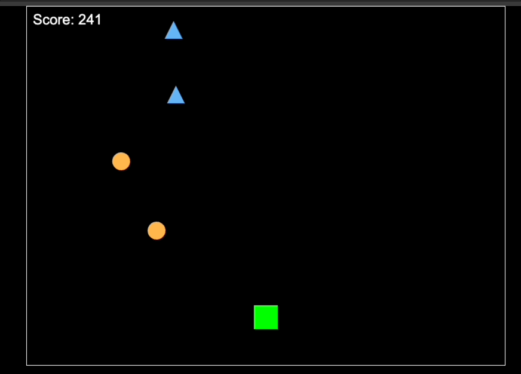

# Spaceship Shooter Game

This is a simple spaceship shooter game built using HTML5 canvas and JavaScript.

Try it in your browser live: https://spaceshooterjs.onrender.com

## Game Overview

In this game, you control a spaceship and your objective is to shoot down enemy spaceships while avoiding collisions. The game features randomly spawning enemies with varying health points (HP) and a scoring system based on the number of enemies destroyed.

## How to Play

- Use the `Arrow Left` and `Arrow Right` arrow keys to move your spaceship horizontally.
- Press the `Spacebar` to shoot bullets at enemies.
- Destroy enemies by shooting them with bullets.
- Avoid colliding with enemy spaceships.
- Your score increases for each enemy destroyed.
- The game ends when your spaceship collides with an enemy.

## Game Mechanics

- The player's spaceship is green and can be moved left or right using arrow keys.
- Enemies spawn at random positions from the top of the canvas.
- Enemies have different HP levels indicated by their color and shape:
  - **Red Enemies (HP: 3):** Rectangular shape
  - **Orange Enemies (HP: 2):** Triangular shape
  - **Blue Enemies (HP: 1):** Circular shape
- Bullets are fired upwards from the player's spaceship.
- The game speed and enemy spawn rate increase as the player's score rises.

## Technologies Used

- HTML5 Canvas
- JavaScript

## How to Run

1. Clone or download the repository to your local machine.
2. Open the `index.html` file in a web browser.

## Game Controls

- `Arrow Left`: Move spaceship left
- `Arrow Right`: Move spaceship right
- `Spacebar`: Shoot bullets

## Author

- Developed by Tushar Mahat
